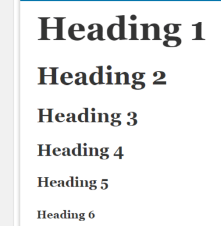
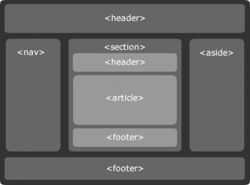

# TAGS
## Definições e conceitos

Tome de exemplo a tag:  `<h1>Mirror Fashion</h1>`

### Caracteres delimitadores
Uma tag é definida com caracteres `<` e `>`

### Texto
Muitas tags possuem conteúdo, como o texto do título.

	Mirror Fashion

### Nome
No exemplo seu nome é:

	H1

### Tag de fechamento
Para determinar onde o conteúdo acaba, usamos uma tag de fechamento com a barra antes do nome.

Tags que não possuem conteúdo, como a tag ``, não necessitam de tag de fechamento
	</h1>

## Estrutura HTML

### TAG HTML
	<html>

Tag principal do nosso documento, dentro dela que será declarada as demais tags.

Dentro dessa tag, é necessário declarar outras duas tags: `<head>` e `<body>`.

```
<html>
	<head>
		<!--- Cabeça --->
	</head>
	<body>
		<!--- Corpo --->
	</body>

</html>
``` 
### TAG HEAD
Contém informações sobre nosso documento que são de interesse somente do navegador, e não dos visitantes do nosso site.

A especificação obriga a presença da tag de conteúdo `<title>` dentro do nosso `<head>`, permitindo especificar o título do nosso documento.

```
<html>
	<head>
		<title>
			Mirror Fashion
		</title>
		<meta charset="utf-8">
		</head>
	<body>
	</body>
</html>
```
#### TAG META
Podemos configurar qual codificação queremos utilizar em nosso documento por meio da configuração de charset na tag `<meta>`

Configuração muito utilizada, principalmente em documentos cujo conteúdo é escrito em um idioma como o português, que tem caracteres como **acentos e cedilha**, é a configuração da codificação de caracteres, chamado de encoding ou charset.

O `UTF-8` é a recomendação atual para encoding na Web por ser amplamente suportada em navegadores e
editores de código, além de ser compatível com praticamente todos os idiomas do mundo.

### TAG BODY
A tag `<body>` contém o corpo do nosso documento.

É necessário que o <body> tenha ao menos um elemento “filho”, ou seja, uma ou mais tags HTML dentro dele.

### INSTRUÇÃO !DOCTYPE
O *DOCTYPE* não é uma tag HTML, mas uma instrução especial. Ela indica para o navegador qual versão do HTML deve ser utilizada para renderizar a página. 

Utilizaremos `<!DOCTYPE html>`, que indica para o navegador a utilização da versão mais recente do HTML - a versão 6, atualmente.

## Textos

### Títulos H
Quando queremos indicar que um texto é um título em nossa página, utilizamos as tags de heading em sua
marcação.

As tags de heading são tags de conteúdo e vão de `<h1>` a `<h6>`, seguindo a ordem de importância.



Os navegadores especiais para acessibilidade também interpretam o conteúdo dessas tags de maneira a diferenciar seu conteúdo e facilitar a navegação do usuário pelo documento.

### Parágrafos 
Quando exibimos qualquer texto em nossa página, é recomendado que ele seja sempre conteúdo de alguma tag filha da tag `<body>`. A marcação mais indicada para textos comuns é a tag de parágrafo `<p>`.

	<p>
		Isso é um parágrafo
	</p>

### Ênfase 

Podemos deixar um texto **“mais forte” com a tag `<strong>`** ou deixar o texto com uma *“ênfase acentuada” com a tag `<em>`*. Também há a tag `<small>`, <small>que diminui o tamanho do texto.</small>

Existem ainda as tags `<b>` e `<i>`, que atingem o mesmo resultado visualmente, mas as tags
`<strong>` e `<em>` são mais indicadas por definirem nossa intenção de significado ao conteúdo, mais do que
uma simples indicação visual.

### Quebra de linha

	<br/>

Essa tag não necessita de fechamento, ela executa a função de quebra de linha

### Linha Horizontal

	<hr/>

Essa tag não necessita de fechamento, ela forma uma linha horizontal.

## Link
Faz a ligação entre um documento e outro, sendo ele da mesma página ou de uma página de outro domínio. Esse elemento garantiu que o HTML se destacasse, e moldou a internet da forma que ela é hoje! Portanto, é o principal fundamento que forma a web.

Para realizar um link, podemos chamar as tags `<a></a>` com o atributo `href`. Por exemplo, caso você queira criar um link no seu texto que redirecione à página inicial do google:

	<p>Para acessar o Google, <a href="https://www.google.com">clique aqui.</a></p>

<p>Para acessar o Google, <a href="https://www.google.com">clique aqui.</a></p>

## Multimídia
Incluir imagens, vídeos, áudios, iframes e outros tipos de conteúdo multimídia.

### Imagem
A tag `` define uma imagem em uma página HTML e necessita de dois atributos preenchidos: 
`src` e `alt`

O primeiro aponta para o local da imagem e o segundo, um texto alternativo para a imagem caso essa não possa ser carregada ou visualizada.

		# Imagem local

		# Volta para pasta pai e navega até a imagem

	 # Imagem publica

A tag `<figure>` define uma imagem com a conhecida tag ``. Além disso, permite adicionar uma legenda para a imagem por meio da tag `<figcaption>`.

	<figure>
		
		<figcaption>
			Esqueleto Dimas
		</figcaption>
	</figure>


<figure>

<figcaption>
Esqueleto Dimas
</figcaption>
</figure>
<br/>

### Video
Indicar a inserção de um vídeo
devemos colocar alguns atributos dentro da tag para poder ativar o controle, a principal dela é o controls. 

Posteriormente, incluímos a tag `<source>` com os atributos `src` e `type`, onde receberão o local em que está o vídeo e o tipo do vídeo. É recomendado utilizar mais de um tipo de source do mesmo vídeo, para garantir maior possibilidade de compatibilidade com o navegador.

Podemos incluir uma mensagem que será renderizada apenas se o navegador do usuário não suportar a tag video.

	<video controls>
		<source src="video.mp4" type="video/mp4">
		<source src="video.ogg" type="video/ogg">
		Seu navegador não possui suporte para Vídeos.
	</video>

### Audio

A tag `<audio>` funciona da mesma forma que a tag `<video>`, portanto, utilizamos a tag `<source>` dentro dela.

	<audio controls>
		<source src="musica.ogg" type="audio/ogg">
		<source src="musica.mp3" type="audio/mpeg">
		Seu navegador não possui suporte para áudio.
	</audio>

### Iframe

Servem para incluir recursos de uma outra página nesta página

Portanto, para inserir um iframe, basta utilizar a tag com o atributo `src`. Além disso, é possível incluir um texto dentro do elemento, caso o navegador do usuário não possua suporte para tal. 

	<iframe src="https://www.homehost.com.br">
		<p>Seu navegador não possui suporte para iFrames.</p>
	</iframe>

## Listas
Podemos utilizar uma lista ordenada, a partir das tags `<ol></ol>`, ou uma lista não ordenada, a partir das tags `<ul></ul>`

Posteriormente, incluímos dentro da lista os elementos da mesma, dentro das tags `<li></li>`.

	<p>Minha lista ordenada:</p>
	<ol>
		<li>item 1</li>
		<li>item 2</li>
		<li>item 3</li>
	</ol>


<p>Minha lista ordenada:</p>
<ol>
  <li>item 1</li>
  <li>item 2</li>
  <li>item 3</li>
</ol>
	<p>Minha lista não ordenada:</p>
	<ul>
		<li>item 1</li>
		<li>item 2</li>
		<li>item 3</li>
	</ul>

<p>Minha lista não ordenada:</p>
<ul>
  <li>item 1</li>
  <li>item 2</li>
  <li>item 3</li>
</ul>

## Formulários
As tags de formulário são muito utilizadas para obter informações do usuário, realizar cadastros, receber opiniões, entre outros

Para iniciar um formulário, incluímos as tags `<form>` e `</form>`. 

Posteriormente, devemos incluir o conteúdo do formulário. Digamos que, por exemplo, você queira incluir três campos, sendo dois para coletar informações e um para receber uma mensagem. 

Desta forma, para criar os campos de preenchimento, deverá utilizar a tag `<input>`, enquanto para o campo referente à mensagem, deverá utilizar a tag `<textarea>`.

### TAG INPUT

A tag `<input>` possui o atributo `type`, que varia entre diversos tipos (vamos explicar os principais deles abaixo). Também há o atributo `placeholder`, que é um texto que ficará disponível enquanto nada for digitado nesse campo. Também é importante definir um atributo name para cada input.

- type = "text"
	- Define um campo que receberá qualquer caractere.
- type = "email"
	- Define um campo que receberá caracteres e verificará se o mesmo consiste em um e-mail válido.
- type = "submit"
	- Define um botão que servirá para o envio do formulário. Dentro dele, podemos atribuir o `value`, que será o texto dentro do botão de envio

[Existem outros tipos de inputs](https://www.w3schools.com/tags/tag_input.asp)

### TAG TEXTAREA
Assim como a tag `<input>`, essa tag define um campo para o formulário. Porém, diferentemente, ela tem como principal característica ser uma área de preenchimento de texto, ou seja, permite que o usuário escreva um texto ou uma mensagem no seu interior. Também traz opções para que o usuário redimensione seu tamanho (resize).

## SCRIPT
A tag `<script></script>` tem como objetivo incluir códigos de scripts ao seu HTML, podendo ser incluída em qualquer parte. Dessa forma, podemos incluir nela um código javascript.


## HTML5
As tags abaixo são utilizadas nos documentos em HTML5, e têm função estrutural no seu código. 

Portanto, essas tags têm grande importância na questão semântica da sua página, saber utilizá-las pode adequar o seu código para uma melhor visualização por parte do navegador e do usuário, além de proporcionar uma otimização para os processos de SEO.




###	`<header>`
Essas tags definem um cabeçalho. Portanto, todo conteúdo que estiver dentro dela faz parte de um cabeçalho

### `<main>`
Essas tags representam o conteúdo principal do seu corpo, ou seja, o conteúdo relacionado diretamente com o tópico central da página ou com a funcionalidade central da aplicação.

### `<footer>`
Essas tags definem um rodapé para a página, geralmente utilizadas no final da página.

### `<section>`
Essas tags definem uma sessão para sua página.

###	`<article>`
Essas tags definem um artigo da sua página. Nesse sentido, são utilizadas para separar o conteúdo da sua página. Muito utilizado principalmente por blogs ou páginas de conteúdo.

### `<aside>`
Essas tags representam uma seção de uma página cujo conteúdo é tangencialmente relacionado ao conteúdo do seu entorno, que poderia ser considerado separado do conteúdo.

### `<nav>`
Essa tag define um conteúdo de navegação. Portanto, é muito utilizado em conjunto com listas e na criação de menus.

### `<div>`
Define uma divisão da página. Desta forma, funciona como um container para conteúdo de fluxo. Uma vez que não possui um valor semântico, é muito utilizado para organizar melhor o conteúdo.

Anteriormente ao HTML5, era utilizado no lugar das categorias acima.


## Tags Expressas

Escrever tags para sites leva muito tempo, por exemplo, `<logo>` `</logo>`, `<navigation>` `</navigation>` e `<sidebar>` `</sidebar>`. Com HTML6, as tags agora são expressas.


Isso significa que podemos criar nossas próprias tags.

Por exemplo, em vez de escrever `<div id = 'container'>`, os programadores podem simplesmente colocar `<container>`.

